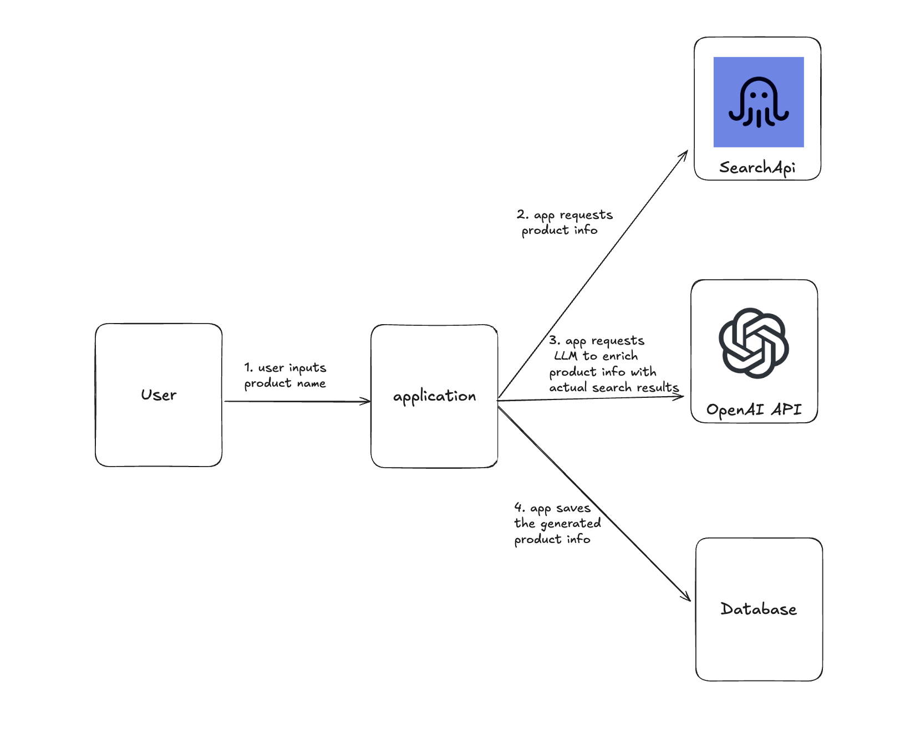

# Dynamic Product Info Generator

## Description
- This is a FastAPI application that generates dynamic product information based on the user's query.
- The application uses the [SearchApi](https://www.searchapi.io/) to search for the product information.
- The application uses the [OpenAI API](https://platform.openai.com/docs/overview) to generate the dynamic product information.

## Points to Note
- LLMs hallucinate information, so the generated data may not be accurate.
- To improve the accuracy of the generated data, the application integrates external APIs or databases to validate and enrich the data.
- The application provides 2 endpoints:
  - `GET /api/products/`: This endpoint searches and returns the response which is generated by ChatGPT.
  - `GET /api/products/sync-external-search`: This endpoint generates the dynamic product information based on the user's query with SearchApi and ChatGPT.

## Pre-requisites
- Python
- FastAPI
- SQLite
- [SearchApi](https://www.searchapi.io/)
- [OpenAI API](https://platform.openai.com/docs/overview)

## Application Flow
- 

## Installation
1. Clone the repository
2. Install the dependencies
```bash
pip install -r requirements.txt
```
3. Create a `.env` file and add the environment variables by referring to the `.env.example` file.

## Usage
1. Run the FastAPI server
```bash
fastapi dev app/main.py
```
2. Open the browser and navigate to `http://localhost:8000/docs`
